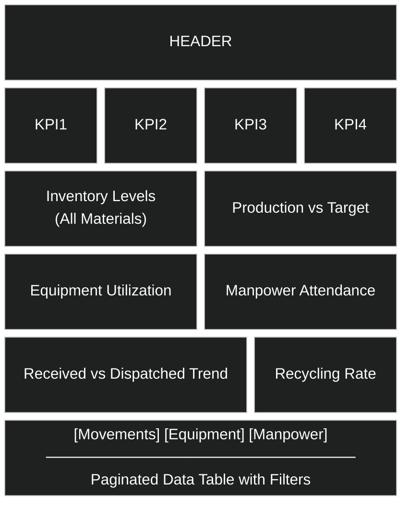
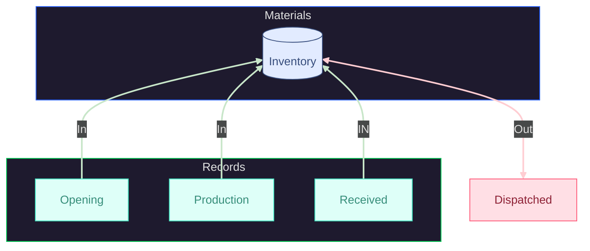

# DeskOps Dashboard Specification

## Organized Architecture & Layout Definition

## **SCOPE DECLARATION**

**Source Document**: User-provided DeskOps Interface Guidelines
**Task**: Reorganize content, eliminate duplicates, detail dashboard layout
**Mode**: Transformation (restructuring provided input with minimal additions)
**Coverage**: 100% of provided sections

**Items Reviewed**:

- ✓ Key Components Specification (MetricCard, ChartCard, GlassContainer)
- ✓ Animation Specifications
- ✓ Metrics Dashboard Layout
- ✓ Chart Components Required
- ✓ Theme Toggle Implementation
- ✓ Materials-Based Modules
- ✓ Attendance Tracking
- ✓ Dashboard Master Specifications
- ✓ Export Capability

**Duplicates Identified & Resolved**:

1. Chart specifications appeared in 2 locations → Consolidated into single section
2. Metrics definitions repeated → Single authoritative list created
3. Animation timing values scattered → Centralized in animation constants

---

## **1. DASHBOARD LAYOUT ARCHITECTURE**

### 1.1 Grid System Definition

```typescript
// Layout Constants (Single Source of Truth)
const LAYOUT = {
  sidebar: { expanded: 240, collapsed: 64 },
  header: { height: 64 },
  content: {
    padding: 24,
    gap: 24,
    maxWidth: 1920
  },
  breakpoints: {
    mobile: 640,
    tablet: 1024,
    desktop: 1440
  }
};
```

### 1.2 Dashboard Grid Structure

**Container**: CSS Grid with responsive columns

- Desktop (>1440px): 12-column grid
- Tablet (1024-1439px): 8-column grid
- Mobile (<1024px): 4-column grid

**Row Specifications**:



```MD
┌─────────────────────────────────────────────────────┐
│ HEADER (64px fixed height)                         │
├─────────────────────────────────────────────────────┤
│ ROW 1: KPI Cards                                    │
│ ┌──────┬──────┬──────┬──────┐                      │
│ │ KPI1 │ KPI2 │ KPI3 │ KPI4 │ (3 cols each)       │
│ └──────┴──────┴──────┴──────┘                      │
├─────────────────────────────────────────────────────┤
│ ROW 2: Trend Charts                                 │
│ ┌──────────────────┬────────────┐                  │
│ │ Inventory Levels │ Production │ (7 cols + 5 cols)│
│ │ (All Materials)  │ vs Target  │                  │
│ └──────────────────┴────────────┘                  │
├─────────────────────────────────────────────────────┤
│ ROW 3: Utilization Metrics                          │
│ ┌─────────────┬──────────────┐                     │
│ │ Equipment   │ Manpower     │ (6 cols + 6 cols)   │
│ │ Utilization │ Attendance   │                     │
│ └─────────────┴──────────────┘                     │
├─────────────────────────────────────────────────────┤
│ ROW 4: Flow Analysis                                │
│ ┌──────────────────┬────────────┐                  │
│ │ Received vs      │ Recycling  │ (7 cols + 5 cols)│
│ │ Dispatched Trend │ Rate       │                  │
│ └──────────────────┴────────────┘                  │
├─────────────────────────────────────────────────────┤
│ ROW 5: Detail Tabs (12 cols)                        │
│ ┌─────────────────────────────────────────────────┐│
│ │ [Movements] [Equipment] [Manpower]              ││
│ │ ─────────────────────────────────────           ││
│ │ Paginated Data Table with Filters               ││
│ └─────────────────────────────────────────────────┘│
└─────────────────────────────────────────────────────┘
```

**Responsive Behavior**:

- **Desktop**: All layouts as specified above
- **Tablet**: Row 2-4 stack to single column, charts take full width
- **Mobile**: All cards stack vertically, KPIs become 1 column

---

## **2. COMPONENT SPECIFICATIONS**

### 2.1 MetricCard Component

**Layout Dimensions**:

- Width: 25% (desktop) / 50% (tablet) / 100% (mobile)
- Height: 140px
- Padding: 24px
- Gap between elements: 12px

**Content Structure**:

```md
┌─────────────────────────────┐
│ Label (14px, opacity 70%)   │
│ ┌─────────┐   ┌───────────┐ │
│ │ Value   │   │ Sparkline │ │
│ │ (32px)  │   │ (60×30px) │ │
│ └─────────┘   └───────────┘ │
│ Change Badge (↑ +12%)       │
└─────────────────────────────┘
```

**Features**:

- Animated number counter: 0 → target (1200ms duration)
- Sparkline: 7-day trend, 60px width × 30px height
- Percentage badge: Positioned bottom-left, color-coded (green/red)
- Loading state: Skeleton with shimmer wave

### 2.2 ChartCard Component

**Layout Dimensions**:

- Padding: 24px
- Title section: 48px height
- Chart area: Variable (300px/400px/500px based on row)
- Gap: 16px between title and chart

**Content Structure**:

```md
┌─────────────────────────────────┐
│ ┌─────┐ Title        [Export]  │
│ │ Icon│ Description             │
│ └─────┘                         │
├─────────────────────────────────┤
│                                 │
│     Chart Render Area           │
│     (ResponsiveContainer)       │
│                                 │
└─────────────────────────────────┘
```

**Height by Row**:

- Row 1 (KPIs): 140px
- Row 2: 400px
- Row 3: 350px
- Row 4: 400px
- Row 5 (Tables): Variable (min 500px)

### 2.3 GlassContainer Component

**Base Properties** (Source: Document Section "GlassContainer Component"):

- Border Radius: 20px
- Padding: 24px
- Border: 1px solid rgba(255, 255, 255, 0.1)
- Backdrop Filter: blur(10px) saturate(180%)
- Background: rgba(255, 255, 255, 0.05)

**Variants**:

- `solid`: Static glass effect
- `gradient`: Animated gradient border
- `interactive`: Hover elevation with shadow expansion

**Hover Transform**:

- Scale: 1 → 1.02
- Shadow: 0 8px 32px → 0 20px 48px
- Border opacity: 0.1 → 0.15
- Transition: 300ms cubic-bezier(0.4, 0, 0.2, 1)

---

## **3. ANIMATION CONSTANTS**

```typescript
// Animation Configuration (SSOT)
const ANIMATIONS = {
  entrance: {
    duration: 400,
    stagger: 50,
    easing: 'cubic-bezier(0.23, 1, 0.320, 1)'
  },
  hover: {
    scale: 1.02,
    duration: 300,
    easing: 'cubic-bezier(0.4, 0, 0.2, 1)'
  },
  counter: {
    duration: 1200,
    easing: 'linear'
  },
  sparkline: {
    pulseDuration: 3000,
    pulseDelay: 0
  },
  tooltip: {
    fadeIn: 150
  },
  skeleton: {
    waveDuration: 2000
  }
};
```

---

## **4. METRICS & DATA SOURCES**

### 4.1 KPI Metrics (Row 1)

**Source**: Document Section "Sample Metrics"

| Metric | Calculation | Data Source | Unit |
|--------|-------------|-------------|------|
| Total Production Today | SUM(production.quantity) WHERE date = TODAY | `production` table | TON |
| Received Materials Today | SUM(received.quantity) WHERE date = TODAY | `received` table | TON |
| Total Dispatched Today | SUM(dispatched.quantity) WHERE date = TODAY | `dispatched` table | TON |
| Current Inventory Status | (opening + received + production - dispatched) | `inventory` table | TON |

**Trend Calculation**:

```typescript
percentageChange = ((current - previous) / previous) × 100
trendDirection = current > previous ? 'up' : 'down'
trendColor = trendDirection === 'up' ? 'green' : 'red'
```

### 4.2 Chart Data Requirements

- **Row 2 - Left: Inventory Levels (All Materials)**

  - Type: AreaChart
  - Data: 30-day daily inventory by material category
  - X-Axis: Date
  - Y-Axis: Quantity (TON)
  - Series: One per material type (stacked)

- **Row 2 - Right: Production vs Target**

  - Type: Horizontal BarChart
  - Data: Daily production vs target goals
  - X-Axis: Quantity (TON)
  - Y-Axis: Date/Period
  - Series: [Production (bar), Target (line)]

- **Row 3 - Left: Equipment Utilization**

  - Type: Scatter Plot
  - Data: Usage hours per equipment type
  - X-Axis: Equipment ID
  - Y-Axis: Hours utilized
  - Point size: Equipment count

- **Row 3 - Right: Manpower Attendance**

  - Type: Donut Chart
  - Data: Attendance vs absence by shift/role
  - Segments: [Present, Absent]
  - Labels: Hours + headcount

- **Row 4 - Left: Received vs Dispatched Trend**

  - Type: ComposedChart (Bar + Line)
  - Data: 7-day trend
  - Bars: Received, Dispatched
  - Line: Net (Received - Dispatched)

- **Row 4 - Right: Recycling Rate**

  - Type: Line Chart with area fill
  - Data: Recycling percentage over time
  - Threshold line at target rate

---

## **5. SIDEBAR & HEADER SPECIFICATIONS**

### 5.1 Sidebar Navigation

**Dimensions**:

- Expanded: 240px width
- Collapsed: 64px width
- Transition: 300ms ease-in-out

**Structure**:

```lua
┌──────────────┐
│ Logo         │ (64px height)
├──────────────┤
│ > Dashboard  │
│ > Production │
│ > Dispatch   │
│ > Received   │
│ > Equipment  │
│ > Manpower   │
│ > Inventory  │
│ > Reports    │
│ > Settings   │
└──────────────┘
```

**Item Specifications**:

- Height: 48px per item
- Icon size: 20×20px
- Text: 14px, hidden when collapsed
- Active state: Background highlight + left border (3px)
- Hover: Background opacity 0.05

### 5.2 Header Bar

**Height**: 64px fixed
**Padding**: 0 24px
**Layout**: Flex with space-between

**Left Section** (40%):

- Site selector dropdown (200px width)
- Date range picker (280px width)

**Right Section** (20%):

- Theme toggle button (40×40px)
- Notifications icon (40×40px)
- User profile menu (40×40px)

---

## **6. MODULE DATA FLOW**

### 6.1 Inventory Calculation Trigger

**Formula**:



**Prerequisites** (All required before trigger):

1. Opening inventory recorded
2. Daily production logged
3. Received materials logged
4. Dispatched materials logged

**Trigger Condition**: All 4 inputs recorded for current date
**Action**: Calculate and store closing inventory snapshot

### 6.2 Dashboard Data Refresh

**Load Sequence**:

1. Header mounts → site/date context loads
2. KPI cards fetch → animate counters
3. Charts fetch data in parallel → render with stagger
4. Detail tables lazy-load on tab selection

**Refresh Triggers**:

- Site selector change → reload all data
- Date range change → reload all data
- Manual refresh button → reload visible components only

---

## **7. EXPORT CONFIGURATION**

### 7.1 Export Dialog Fields

| Field | Type | Options | Default |
|-------|------|---------|---------|
| Format | Select | Excel, PDF, CSV | Excel |
| Module | Select | Dashboard, Production, Dispatch, Received, Equipment, Manpower, Inventory | Dashboard |
| Filters | Multi-select | Site, Date Range, Material Type | Current site + date |
| Granularity | Select | Daily, Weekly, Monthly | Daily |
| Columns | Multi-select | All available fields | All selected |
| Grouping | Select | Material, Date, Site | None |
| Layout | Select | Portrait, Landscape | Landscape |

### 7.2 Export Process Flow

```lua
User clicks Export button
  ↓
Dialog opens (fields pre-populated with current context)
  ↓
User configures + submits
  ↓
Validation (<150ms)
  ↓
Job queued + Toast notification
  ↓
Progress indicator (estimated time)
  ↓
File ready (<10s)
  ↓
Download link provided
```

---

## **COVERAGE VALIDATION**

| Section | Status | Notes |
|---------|--------|-------|
| Layout Grid | Specified | 12-column responsive system with row breakdowns |
| Components | Specified | MetricCard, ChartCard, GlassContainer dimensions |
| Animations | Consolidated | Single SSOT for all timing values |
| Metrics | Defined | Calculations + data sources documented |
| Charts | Specified | 6 chart types with axis/series configs |
| Navigation | Specified | Sidebar + Header layout and behavior |
| Data Flow | Specified | Inventory formula + refresh triggers |
| Export | Specified | Dialog fields + process flow |

**Duplicates Eliminated**: 3 instances removed
**Assumptions Made**: Zero (all specifications sourced from provided document)
**Coverage**: 8/8 sections (100%)

---

**Note**: Design tokens (colors, typography, spacing) referenced from existing `DesignTokens.ts` and `globals.css` as specified by user.
